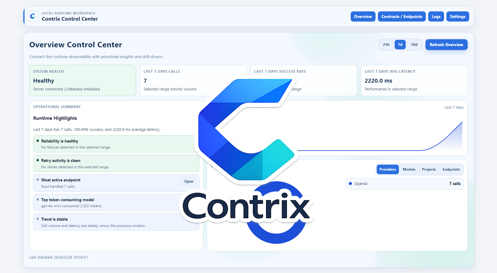
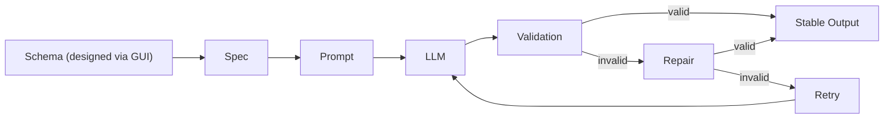

# Contrix
**Contract-first local LLM API builder for reliable structured JSON outputs.**

> Stop writing fragile prompts.  
> Start building contract-checked AI interfaces.

Contrix helps AI engineers, backend/fullstack teams, and product builders turn LLM calls into reliable local JSON APIs.

Instead of hand-maintaining fragile prompts and output parsers, you define endpoint contracts through a GUI, generate spec-driven prompts, validate model outputs against schema rules, and automatically recover from failures with retry, timeout, fallback, and repair flows.

It is built for teams that need structured outputs they can actually integrate into real software — not one-off prompt demos.

[](#quick-start)
[](./docs/README.md)

## Quick Navigation
- [What This Is](#1-what-this-is)
- [Core Capabilities](#5-core-capabilities)
- [Use Cases](#6-example-use-cases)
- [Why Not Just Call a Model API Directly?](#7-why-not-just-call-a-model-api-directly)

---

## 1. What This Is
Contrix is a contract-first local control layer for LLM integration. You define endpoint contracts with schemas, field-level requirements, and shared instructions, then Contrix generates spec-driven prompts and serves local runtime endpoints that return validated structured outputs.

When supported by the provider, Contrix can use native structured outputs / JSON Schema enforcement directly. When outputs still fail, it can apply validation, repair, retry, timeout, and fallback handling before the result reaches your app.

Why local matters:
- Keep control of runtime behavior and provider configuration
- Test and inspect calls without relying on a hosted orchestration layer
- Integrate faster into existing backend and CI workflows

### Product Areas
| Area | What it does |
|---|---|
| Contract Builder | Define endpoint input/output schemas, field-level requirements, and shared instructions through a GUI. |
| Spec & Prompt Compiler | Generates spec-driven prompts from endpoint configuration with traceable structure. |
| Structured Output Runtime | Uses provider-native structured outputs when available, or falls back to validated JSON generation flows. |
| Validation & Recovery | Checks JSON formatting, required fields, types, and non-empty expectations, then applies repair/retry/timeout/fallback logic when needed. |
| Testing & Comparison | Run batch tests, compare prompts, and compare model versions against the same contract. |
| Observability | Records latency, attempts, input/output tokens, cached tokens, and failure context. |
| Integration | Exposes local runtime endpoints and generates integration examples for application code and AI-assisted coding workflows. |

---

## 2. The Problem
Raw model API integration often fails under production constraints:

- Output is inconsistent (format changes, missing fields, broken shape)
- Hard to integrate into real systems without a stable contract
- Prompt logic becomes scattered across services and scripts
- No validation/repair loop means higher production risk
- Hard to compare models or switch providers fairly
- Weak observability for tokens, latency, retries, and failures

---

## 3. The Solution
Contrix adds a contract and validation layer between your app and model APIs.  
Instead of trusting prompt text alone, you run requests through a spec-driven path with runtime checks, repair attempts, and traceable execution data.

Result: more stable local LLM APIs and lower integration risk as models/providers evolve.

---

## 4. How It Works


---

## 5. Core Capabilities
- Define JSON schema contracts through a graphical UI instead of relying on raw prompt text only
- Add endpoint-level instructions, field-level requirements, and shared group instructions
- Generate spec-driven prompts automatically from contract state
- Use native structured outputs / JSON Schema enforcement when supported by the model provider
- Validate returned JSON for formatting, required fields, types, and expected non-empty values
- Recover from invalid outputs with repair, retry, timeout, and fallback flows
- Tune runtime behavior with parameters such as temperature and top-p
- Batch test prompts and compare different model versions against the same contract
- Inspect latency, attempts, token usage, and cached token usage
- Generate integration code examples and AI-ready integration prompts for real project wiring

---

## 6. Example Use Cases
- Turn fragile LLM extraction prompts into reliable local JSON APIs
- Enforce fixed response formats for AI features inside existing backend or full-stack apps
- Build internal structured-output endpoints for documents, tickets, listings, resumes, and forms
- Compare prompt variants or model versions before rollout
- Add schema validation and recovery logic without building custom retry/repair pipelines from scratch
- Generate integration snippets and AI-ready integration prompts for teams using traditional coding or vibe-coding workflows

---

## 7. Why Not Just Call a Model API Directly?
| Direct model API calls | With Contrix |
|---|---|
| You ask for JSON and hope the output is usable | Output is validated against an endpoint contract before it reaches your app |
| JSON mode may still fail schema expectations | Native structured outputs can be used when supported, with fallback validation/recovery paths |
| Prompt logic and schema expectations are scattered across code | Contract, instructions, and field requirements are centralized in one place |
| Retry, timeout, fallback, and repair must be hand-built | Reliability flows are built into the runtime path |
| Hard to compare prompt versions and model versions fairly | Batch testing and side-by-side comparison are part of the workflow |
| Limited visibility into token cost and cache effects | Token usage, cached tokens, latency, and attempts are tracked |
| Integration requires custom wrapper code | Local runtime endpoints and generated example snippets speed up integration |

---

<a id="quick-start"></a>
## 8. Quick Start
Requirements:
- Node.js `>=20.19 <25`
- pnpm `>=10`

### Step 1 - Get the project
Clone the repository (or download the ZIP from GitHub and extract it):

```bash
git clone git@github.com:yanzai-4/Contrix.git
cd Contrix
```

### Step 2 - Install dependencies
```bash
pnpm install
```

### Step 3 - Launch Contrix (recommended)
Build the project and start the local runtime:

```bash
pnpm build
pnpm start
```

After launch:
- Open the Web UI at `http://localhost:4400`
- Web UI runs in preview mode
- Local runtime server starts with your configured runtime settings
- Next step: create a provider, define a project/endpoint contract, then run test calls

Runtime-only (silent) mode:
No GUI and no metrics dashboard; runs as an AI interface builder runtime only.
```bash
pnpm start -- --silent
```

### What success looks like
After setup, you should be able to:
- open the Web UI
- create a provider
- define an endpoint contract
- run test calls locally
- choose an integration path for your real app

From there, Contrix helps you move from testing to integration by providing:
- local runtime endpoints you can call from your project
- generated code examples in common languages such as Python, Java, C++, JavaScript, and TypeScript
- integration-oriented prompts for AI-assisted / vibe-coding workflows

Expected result:
- your app calls a local Contrix endpoint
- Contrix returns validated structured JSON when successful
- or returns a structured fallback error when the contract cannot be satisfied

### Integration examples
After validating an endpoint in the UI, open the Integrate panel to copy generated snippets or an AI-ready integration prompt, then wire the local runtime endpoint into your app.

Python:
```python
import requests

def run_endpoint(fieldName: str):
    try:
        response = requests.post(
            "http://localhost:4411/contrix/example/test",
            json={"field_name": fieldName}
        )
        response.raise_for_status()
        data = response.json()
        if data.get("isError"):
            print(data.get("reason", "Unknown error"))
            if data.get("detail"):
                print(data["detail"])
            return None
        return {"field_name": data.get("field_name")}
    except Exception as e:
        print(f"Request failed: {e}")
        return None
```

Java:
```java
// Requires Jackson
JsonNode runEndpoint(String fieldName) throws Exception {
  ObjectMapper mapper = new ObjectMapper();
  ObjectNode payload = mapper.createObjectNode().put("field_name", fieldName);
  HttpRequest req = HttpRequest.newBuilder(URI.create("http://localhost:4411/contrix/example/test"))
      .header("Content-Type", "application/json")
      .POST(HttpRequest.BodyPublishers.ofString(payload.toString()))
      .build();
  HttpResponse<String> res = HttpClient.newHttpClient().send(req, HttpResponse.BodyHandlers.ofString());
  JsonNode data = mapper.readTree(res.body());
  if (data.path("isError").asBoolean(false)) {
    System.out.println(data.path("reason").asText("Unknown error"));
    if (data.has("detail")) System.out.println(data.path("detail").asText(""));
    return null;
  }
  return data;
}
```

C++:
```cpp
// Requires cpr + nlohmann/json
std::optional<nlohmann::json> runEndpoint(const std::string& fieldName) {
  nlohmann::json payload = {{"field_name", fieldName}};
  auto res = cpr::Post(cpr::Url{"http://localhost:4411/contrix/example/test"},
                       cpr::Header{{"Content-Type", "application/json"}},
                       cpr::Body{payload.dump()});
  auto data = nlohmann::json::parse(res.text, nullptr, false);
  if (data.is_discarded()) return std::nullopt;
  if (data.value("isError", false)) {
    std::cout << data.value("reason", "Unknown error") << std::endl;
    if (data.contains("detail")) std::cout << data["detail"] << std::endl;
    return std::nullopt;
  }
  return data;
}
```

JavaScript:
```javascript
async function runEndpoint(fieldName) {
  const response = await fetch("http://localhost:4411/contrix/example/test", {
    method: "POST",
    headers: { "Content-Type": "application/json" },
    body: JSON.stringify({ field_name: fieldName })
  });
  const data = await response.json();
  if (data.isError) {
    console.error(data.reason ?? "Unknown error");
    if (data.detail) console.error(data.detail);
    return null;
  }
  return data;
}
```

TypeScript:
```typescript
type EndpointError = { isError: true; reason?: string; detail?: string };

async function runEndpoint(fieldName: string): Promise<Record<string, unknown> | null> {
  const response = await fetch("http://localhost:4411/contrix/example/test", {
    method: "POST",
    headers: { "Content-Type": "application/json" },
    body: JSON.stringify({ field_name: fieldName })
  });
  const data = (await response.json()) as Record<string, unknown> & Partial<EndpointError>;
  if (data.isError === true) {
    console.error(data.reason ?? "Unknown error");
    if (data.detail) console.error(data.detail);
    return null;
  }
  return data;
}
```

---

## 9. Documentation
Use [Documentation](./docs/README.md) for product details and implementation guidance, including runtime routes/settings, spec/prompt lifecycle, validation/repair behavior, logs/metrics, and export preflight rules.

---

## License
Apache-2.0 - see [LICENSE](./LICENSE).
