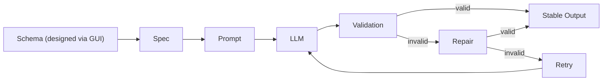

# Contrix
**Contract-first local AI interface builder for model-backed APIs.**

> Stop writing fragile prompts.  
> Start building contract-checked AI interfaces.

Contrix helps AI engineers, backend/fullstack teams, and product builders define endpoint contracts, compile prompts from spec state, and run local runtime APIs with validation, repair, and observability.  
It is designed for teams that need predictable integration behavior, not one-off prompt scripts.

[](#quick-start)
[](./docs/README.md)

## Quick Navigation
- [What This Is](#1-what-this-is)
- [Core Capabilities](#5-core-capabilities)
- [Use Cases](#6-example-use-cases)
- [Why Not Just Call a Model API Directly?](#7-why-not-just-call-a-model-api-directly)

---

## 1. What This Is
Contrix is a contract-first local control layer for LLM integration. You define interface contracts (schemas + behavior rules), Contrix compiles runtime prompts and serves local endpoints that return validated, contract-checked outputs.

Why local matters:
- Keep control of runtime behavior and provider configuration
- Test and inspect calls without relying on a hosted orchestration layer
- Integrate faster into existing backend and CI workflows

### Product Areas
| Area | What it does |
|---|---|
| Contracts | Define per-endpoint input/output schemas and behavior rules. |
| Prompt Compiler | Generates prompts from spec state with versioned traceability. |
| Runtime | Exposes local API endpoints behind a consistent contract boundary. |
| Validation | Checks model output against schema and captures failure context. |
| Repair & Retry | Applies bounded repair/retry/fallback flows when output is invalid. |
| Logs & Metrics | Records replay data, attempts, latency, and token/cache usage. |

---

## 2. The Problem
Raw model API integration often fails under production constraints:

- Output is inconsistent (format changes, missing fields, broken shape)
- Hard to integrate into real systems without a stable contract
- Prompt logic becomes scattered across services and scripts
- No validation/repair loop means higher production risk
- Hard to compare models or switch providers fairly
- Weak observability for tokens, latency, retries, and failures

---

## 3. The Solution
Contrix adds a contract and validation layer between your app and model APIs.  
Instead of trusting prompt text alone, you run requests through a spec-driven path with runtime checks, repair attempts, and traceable execution data.

Result: more stable local Model APIs and lower integration risk as models/providers evolve.

---

## 4. How It Works


---

## 5. Core Capabilities
- Define per-endpoint input and output schemas
- Configure behavior rules, examples, and constraints in one place
- Compile endpoint specs into runtime prompts
- Test calls locally before integrating them into your app
- Inspect validation failures, repair attempts, latency, and token usage

---

## 6. Example Use Cases
- Extract structured fields from contracts, resumes, support tickets, and listings
- Build internal Model APIs that product/backend services can integrate safely
- Normalize outputs across multiple Model API providers with one endpoint contract
- Run batch regression checks for endpoint contracts before rollout
- Compare model candidates on the same test inputs and acceptance criteria
- Replace fragile prompt scripts with maintainable, versioned interface specs

---

## 7. Why Not Just Call a Model API Directly?
| Direct model API calls | With Contrix |
|---|---|
| Prompt and parsing logic spread across codebases | Spec-driven contract is centralized and versioned |
| Output shape can drift unexpectedly | Output is validated against endpoint schema |
| Reliability logic is custom and duplicated | Validation/repair/retry/fallback path is standardized |
| Model/provider switches require rework | Same endpoint contract supports controlled model/provider changes |
| Hard to run fair model comparisons | Same contract + test inputs enables comparable evaluations |
| Debugging needs scattered tooling | Local logs, replay, latency, and token/cache metrics are built in |

---

<a id="quick-start"></a>
## 8. Quick Start
Requirements:
- Node.js `>=20.19 <25`
- pnpm `>=10`

### Step 1 - Get the project
Clone the repository (or download the ZIP from GitHub and extract it):

```bash
git clone git@github.com:yanzai-4/Contrix.git
cd Contrix
```

### Step 2 - Install dependencies
```bash
pnpm install
```

### Step 3 - Launch Contrix (recommended)
Build the project and start the local runtime:

```bash
pnpm build
pnpm start
```

After launch:
- Open the Web UI at `http://localhost:4400`
- Web UI runs in preview mode
- Local runtime server starts with your configured runtime settings
- Next step: create a provider, define a project/endpoint contract, then run test calls

Runtime-only (silent) mode:
No GUI and no metrics dashboard; runs as an AI interface builder runtime only.
```bash
pnpm start -- --silent
```

---

## 9. Documentation
Use [Documentation](./docs/README.md) for product details and implementation guidance, including runtime routes/settings, spec/prompt lifecycle, validation/repair behavior, logs/metrics, and export preflight rules.

---

## License
Apache-2.0 - see [LICENSE](./LICENSE).
