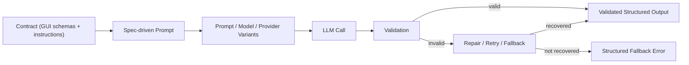

# Contrix
**Contract-first local workflow for structured LLM endpoints, comparison, validation/recovery, and app integration.**

> Stop writing fragile prompts.  
> Start building contract-checked AI interfaces.

Contrix helps AI engineers, backend/fullstack teams, and product builders turn LLM calls into reliable local JSON APIs they can actually integrate into real software.

Instead of hand-maintaining fragile prompts, provider-specific schema glue, and custom output parsers, you define endpoint contracts through a GUI, generate spec-driven prompts, compare prompts/models/providers under the same contract, validate outputs, and recover from failures with retry, timeout, fallback, and repair flows.

It is built for teams that need a structured-output workflow they can design, test, compare, observe, and integrate — not just one-off prompt demos.

Contrix is not just a wrapper around provider-native structured outputs — it adds a contract-first workflow for comparison, recovery, observability, and integration.

[](#quick-start)
[](./docs/README.md)

## Quick Navigation
- [What This Is](#1-what-this-is)
- [Core Capabilities](#5-core-capabilities)
- [Use Cases](#6-example-use-cases)
- [Why Not Just Call a Model API Directly?](#7-why-not-just-call-a-model-api-directly)

---

## 1. What This Is
Contrix is a contract-first local control layer for LLM integration. You define endpoint contracts with schemas, field-level requirements, and shared instructions, then Contrix generates spec-driven prompts and serves local runtime endpoints that return validated structured outputs.

When supported by the provider, Contrix can use native structured outputs / JSON Schema enforcement directly. But Contrix is more than a wrapper around provider-native schema features: it adds prompt/model/provider comparison, validation and recovery flows, observability, and integration-ready local runtime endpoints around the contract itself.

Why local matters:
- Keep control of runtime behavior and provider configuration
- Test and inspect calls without relying on a hosted orchestration layer
- Integrate faster into existing backend and CI workflows

### Product Areas
| Area | What it does |
|---|---|
| Contract Builder | Define endpoint input/output schemas, field-level requirements, and shared instructions through a GUI. |
| Spec & Prompt Compiler | Generates spec-driven prompts from endpoint configuration with traceable structure. |
| Comparison Workflow | Compare prompts, model versions, and providers side by side under the same endpoint contract. |
| Structured Output Runtime | Uses provider-native structured outputs / JSON Schema enforcement when available, while keeping one contract workflow across providers. |
| Validation & Recovery | Checks JSON formatting, required fields, types, and non-empty expectations, then applies repair/retry/timeout/fallback logic when needed. |
| Observability | Records latency, attempts, input/output tokens, cached tokens, and failure context. |
| Integration | Exposes integration-ready local runtime endpoints and generates code examples plus one-click copyable vibe-coding prompts. |

---

## 2. The Problem
Raw model API integration often fails under production constraints:

- Output can drift (invalid JSON shape, missing fields, unexpected types)
- Structured output support is provider-specific and tied to each API style
- Prompt, schema, and parser logic becomes scattered across services and scripts
- No built-in validation/recovery path means higher production risk
- Hard to compare prompts/models/providers fairly under one contract
- Weak observability for tokens, cached tokens, latency, retries, and failures

---

## 3. The Solution
Contrix adds a contract, comparison, validation, and integration layer between your app and model APIs.
Instead of stopping at "the model returned JSON," you can design one endpoint contract, test it across prompts/models/providers, inspect runtime behavior, and integrate a stable local endpoint into your application.

Result: a more practical structured-output workflow for real software systems, with lower integration risk as prompts, providers, and models evolve.

---

## 4. How It Works
The same endpoint contract can be tested across prompt variants and model/provider combinations before being integrated into your app through a stable local runtime endpoint.



---

## 5. Core Capabilities
- Design endpoint contracts through a graphical UI instead of relying on raw prompt text only
- Add field-level requirements, endpoint-level instructions, and shared group instructions
- Generate spec-driven prompts automatically from contract state
- Use provider-native structured outputs / JSON Schema enforcement when supported
- Validate returned JSON shape, required fields, types, and expected non-empty values
- Recover from invalid outputs with retry, timeout, fallback, and repair flows
- Compare prompts, model versions, and providers side by side under the same endpoint contract
- Inspect input tokens, output tokens, cached tokens, latency, and attempts
- Generate integration-ready local runtime endpoint usage examples
- Generate one-click copyable AI-ready vibe-coding prompts for app wiring

---

## 6. Example Use Cases
- Turn fragile extraction prompts into stable local endpoints
- Compare prompt variants before rollout
- Compare model/provider behavior under one contract
- Add recovery and observability without hand-building custom pipelines
- Build contract-checked structured-output endpoints for documents, tickets, listings, resumes, and forms
- Generate integration snippets and AI-ready prompts for real project wiring

---

## 7. Why Not Just Call a Model API Directly?
| Direct model API calls | With Contrix |
|---|---|
| You ask for JSON and hope the output is usable | Output is validated against an endpoint contract before it reaches your app |
| Structured output support is provider-specific and tied to each API style | One contract surface can be tested across prompts, models, and providers |
| Prompt logic and schema expectations are scattered across code | Contract, instructions, and field requirements are centralized in one place |
| Retry, timeout, fallback, and repair must be hand-built | Recovery flows are built into the runtime path |
| Hard to compare prompt versions and model/provider behavior fairly | Comparison workflow runs side by side under the same endpoint contract |
| Limited visibility into token cost and cache effects | Token usage, cached tokens, latency, and attempts are tracked |
| Integration requires custom wrapper code | A local runtime endpoint, generated code examples, and one-click vibe-coding prompts speed up app integration |

---

<a id="quick-start"></a>
## 8. Quick Start
Requirements:
- Node.js `>=20.19 <25`
- pnpm `>=10`

### Step 1 - Get the project
Clone the repository (or download the ZIP from GitHub and extract it):

```bash
git clone git@github.com:yanzai-4/Contrix.git
cd Contrix
```

### Step 2 - Install dependencies
```bash
pnpm install
```

### Step 3 - Launch Contrix (recommended)
Build the project and start the local runtime:

```bash
pnpm build
pnpm start
```

After launch:
- Open the Web UI at `http://localhost:4400`
- Web UI runs in preview mode
- Local runtime server starts with your configured runtime settings
- Next step: create a provider, define a contract, run and compare test calls, then choose your integration path

Runtime-only (silent) mode:
No GUI and no metrics dashboard; runs as an AI interface builder runtime only.
```bash
pnpm start -- --silent
```

### What success looks like
After setup, you should be able to:
- open the Web UI
- create a provider
- define an endpoint contract
- run and compare test calls locally
- choose an integration path for your real app

From there, Contrix helps you move from testing to integration by providing:
- local runtime endpoints you can call from your project
- generated code examples in common languages such as Python, Java, C++, JavaScript, and TypeScript
- one-click copyable prompts you can paste into AI-assisted / vibe-coding workflows to wire the endpoint quickly

Expected result:
- your app calls a local Contrix endpoint
- Contrix returns validated structured JSON when successful
- or returns a structured fallback error when the contract cannot be satisfied

### Integration examples
After validating and comparing an endpoint in the UI, open the Integrate panel and one-click copy either a generated code snippet or an AI-ready vibe-coding prompt, then wire the local runtime endpoint into your app.  
Below is a concise Python example. For Java, C++, JavaScript, and TypeScript snippets, use the Integrate panel in the Web UI.

Python:
```python
import requests

def run_endpoint(fieldName: str):
    try:
        response = requests.post(
            "http://localhost:4411/contrix/example/test",
            json={"field_name": fieldName}
        )
        response.raise_for_status()
        data = response.json()

        if data.get("isError"):
            print(data.get("reason", "Unknown error"))
            if data.get("detail"):
                print(data["detail"])
            return None

        return {"field_name": data.get("field_name")}
    except Exception as e:
        print(f"Request failed: {e}")
        return None

result = run_endpoint("string")
print(result)
```

---

## 9. Documentation
Use [Documentation](./docs/README.md) for product details and implementation guidance, including runtime routes/settings, spec/prompt lifecycle, validation/recovery behavior, logs/metrics, and export preflight rules.

---

## License
Apache-2.0 - see [LICENSE](./LICENSE).
